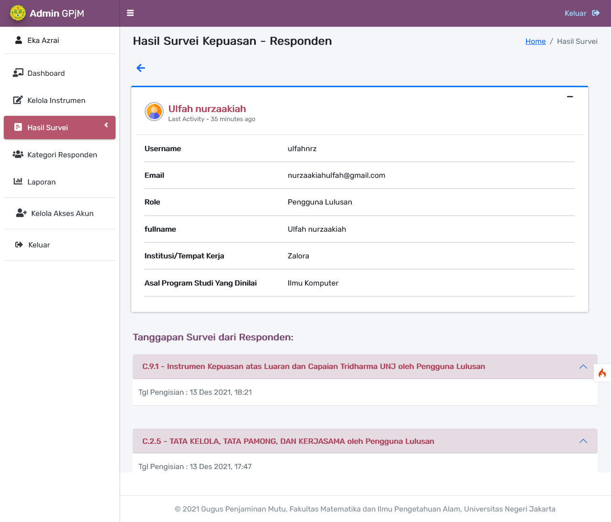
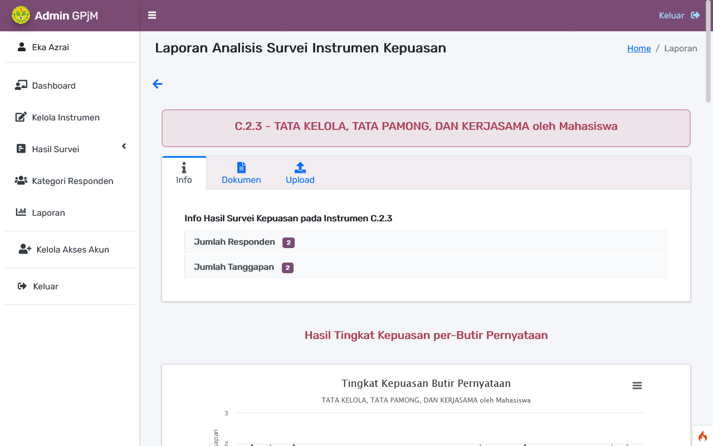

<h2 align="center">Sistem Informasi Survei Kepuasan Pengguna Layanan Berbasis Web untuk Penjaminan Mutu Internal di FMIPA UNJ</h2>

<strong> Aplikasi ini dibuat sebagai alat bantu pengukuran sekaligus peningkatan kualitas mutu layanan di FMIPA UNJ dengan mengetahui kepuasan responden melalui survei, dan mempermudah proses analisis tingkat kepuasan.</strong>
   

 Project dibuat sebagai syarat untuk memperoleh gelar Sarjana Komputer dari  Program Studi Ilmu Komputer Universitas Negeri Jakarta  
- Februari 2022 - 

_This site was built using [Codeigniter 4](http://codeigniter.com/)_

 

# Fitur

**1. GPjM**

- mengelola data instrumen berupa kuesioner yang akan diisi oleh responden.
- melihat hasil tanggapan survei.
- mengelola data responden beserta tanggapannya.
- mengelola laporan hasil analisis kepuasan.
- melihat hasil analisis kepuasan dari setiap instrumen dan setiap butir pernyataannya.
- melihat kategori responden.
- mengelola pertanyaan untuk data diri kategori responden.
- membuat akun GPjM yang lainnya dan akun Kontributor agar mendapat akses ke halaman dashboard.
- mengelola akun dosen untuk akses instrumen tertentu beserta mengelola akun GPjM lainnya dan akun kontributor.
- menampilkan atau menyembunyikan hasil survei kepuasan pada instrumen tertentu ke website.

**2. Kontributor**

- melakukan Login dengan akun SIAKAD yang untuk masuk ke sistem.
- melihat data instrumen.
- melihat hasil tanggapan survei .
- melihat data responden.
- melihat laporan hasil analisis kepuasan.
- melihat grafik tingkat kepuasan dari setiap instrumen dan setiap butir pernyataannya.
- melihat kategori responden.
- melihat pertanyaan untuk data diri kategori responden.

**3. Responden**

- mengisi survei dengan menjawab butir pernyataan pada instrumen yang dipilih, berupa skala tingkat kepuasan dari Sangat Puas hingga Sangat Tidak Puas. Instrumen tertentu hanya dapat diisi oleh responden tertentu saja.
- melihat Riwayat pengisian survei yang sudah pernah diisi oleh responden tersebut.
- mengubah profil data diri.

**4. Pengunjung Website**

- Pengunjung dapat melihat hasil survei kepuasan pada instrumen tertentu pada website tanpa melakukan Login.

# Screenshot

<h2 align="center">Landing Page</h2>

|                                     |                                     |
| :---------------------------------: | :---------------------------------: |
|  |  |
|                                     |                                     |
|  |                                     |

 
<h2 align="center">Authentication</h2>

|                                      |                                             |
| :----------------------------------: | :-----------------------------------------: |
|               Register               |               Cek Akun SIAKAD               |
|  |        |
|                Login                 | Register untuk Responden dengan akun SIAKAD |
|     |       |

 
<h2 align="center">Halaman Responden</h2>

|                                                     |                                                     |
| :-------------------------------------------------: | :-------------------------------------------------: |
|                   Form Data Diri                    |                   Pilih Instrumen                   |
|  |             |
|                     Isi Survei                      |                                                     |
|      |        |
|                                                     |                                                     |
|        |  |
|              Riwayat Pengisian Survei               |                                                     |
|      |                                                     |

 
<h2 align="center">Halaman GPjM - Kelola Survei</h2>

|                                                            |                                                              |
| :--------------------------------------------------------: | :----------------------------------------------------------: |
|                         Dashboard                          |                  Kelola Kategori Instrumen                   |
|                |     |
|                  Edit Kategori Instrumen                   |                  Tambah Kategori Instrumen                   |
|     |     |
|                      Kelola Instrumen                      |                   Kelola Butir Pernyataan                    |
|  |  |
|                  Kelola Butir Pernyataan                   |                 Form Tambah Butir Pernyataan                 |
|    |   |

 
<h2 align="center">Halaman GPjM - Kelola Jenis Responden</h2>

|                                                                  |                                                                    |
| :--------------------------------------------------------------: | :----------------------------------------------------------------: |
|                      Kelola Jenis Responden                      |            Kelola Pertanyaan untuk Data Diri Responden             |
|               |  |
|                 Form Tambah Pertanyaan Data Diri                 |                                                                    |
|  |                                                                    |

 
<h2 align="center">Halaman GPjM - Kelola Hasil Survei</h2>

|                                                              |                                                                |
| :----------------------------------------------------------: | :------------------------------------------------------------: |
|                  Hasil Survei per-Responden                  |                      Data Diri Responden                       |
|            |     |
|                  Tanggapan Survei Responden                  |                   Hasil Survei per-Instrumen                   |
|   |              |
|                  Hasil Survei per-Instrumen                  |                   Hasil Survei per-Instrumen                   |
|  |  |
|                  Hasil Survei per-Instrumen                  |                                                                |
|  |                                                                |

 
<h2 align="center">Halaman GPjM - Laporan</h2>

|                                                        |                                                          |
| :----------------------------------------------------: | :------------------------------------------------------: |
|             Kelola Laporan Hasil Analisis              |            Pilih Instrumen untuk Lihat Hasil             |
|               |      |
|             Hasil Analisis pada Instrumen              |              Hasil Analisis pada Instrumen               |
|  |  |

 
<h2 align="center">Halaman GPjM - Kelola Akses Akun</h2>

|                                                                     |                                                          |
| :-----------------------------------------------------------------: | :------------------------------------------------------: |
|                        List Responden Dosen                         |         Kelola Akses Instrumen - Responden Dosen         |
|                    |         |
|                 Membuat Akses Instrumen untuk Dosen                 |              Kelola Akses Akun Kontributor               |
|  |  |
|                    GPjM membuat Akun Kontributor                    |                                                          |
|   |                                                          |

## Contact

- **Maura Qoonitah Putri** - _Initial work_ - [mauraqoonitah](https://github.com/mauraqoonitah)
